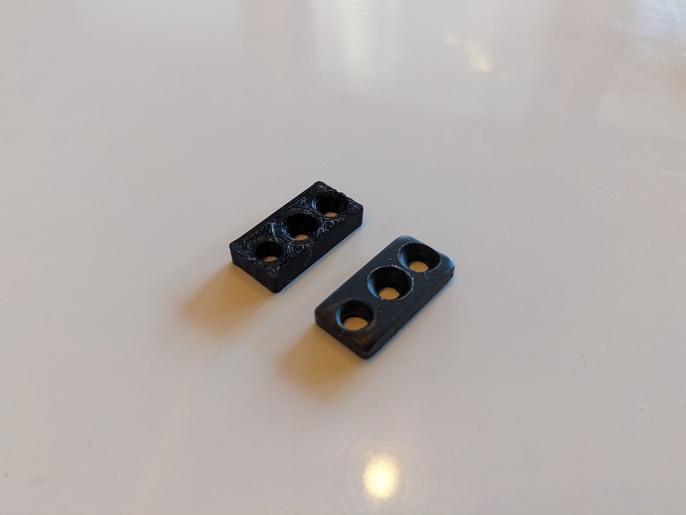
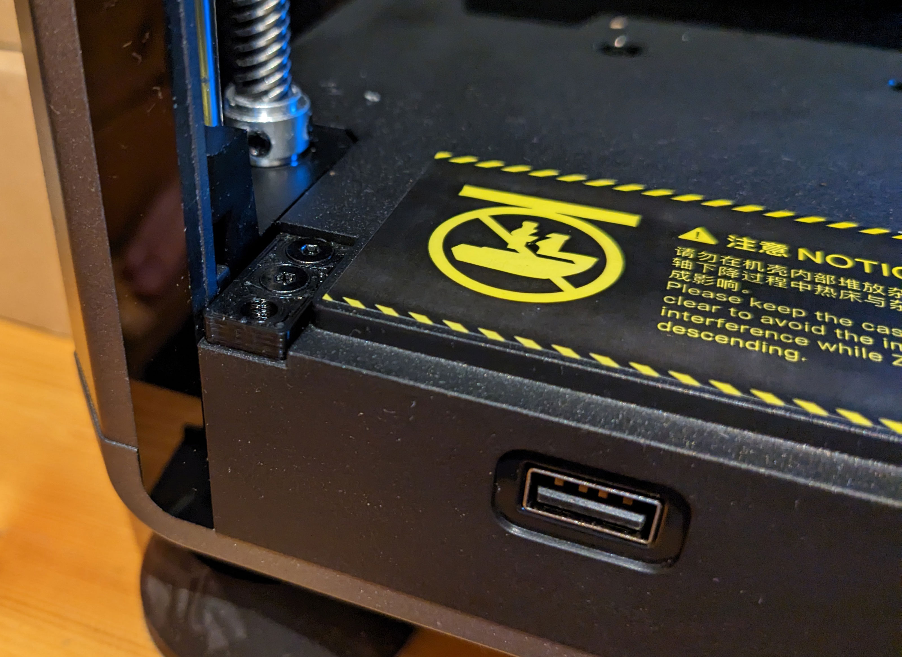

# Door rattling

The glass door of the Creality K1 is fitted at the top and bottom by a metal plate with a hole. However, this hinge
doesn't fit perfectly in the vertical direction, and thus the door can rattle during faster movements. Furthermore, the
door touches lightly over the display. The following mod is available for this. The door is lifted a small distance
upwards and has no room to wobble.

<figure markdown>
  { width="800" }
  <figcaption>Compare printed plated with original metal plate</figcaption>
</figure>

<figure markdown>
  { width="800" }
  <figcaption>Installed new door plate from D3vil.Design</figcaption>
</figure>

- Download: [Creality K1 door rattel fix by D3vil.Design on Printables](https://www.printables.com/model/485633-creality-k1-door-rattel-fix){:target="_blank"}
