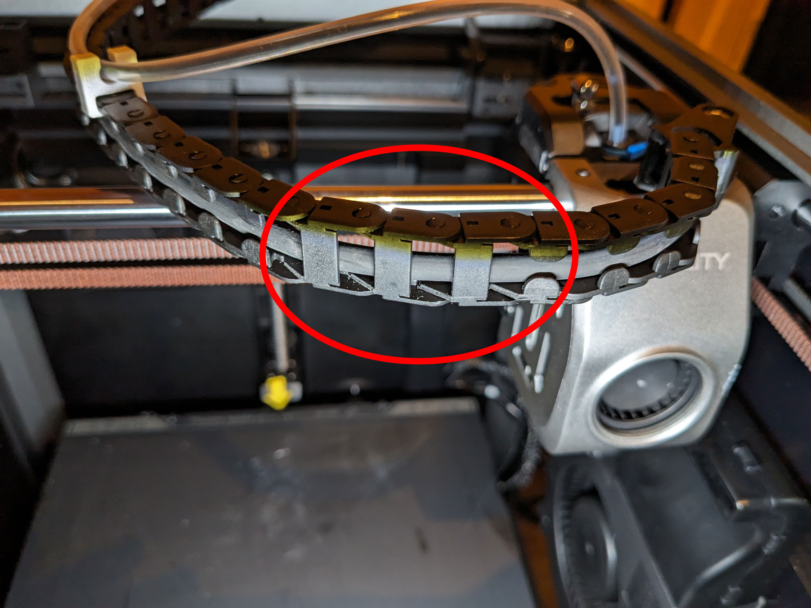

# Filament path

The filament path of the Creality K1 squeezes the filament, especially in the left-rear part of the print bed.
Furthermore, this position can also lift/throw down the top panel. Two printable modifications solve this problem. I
have decided to use the following mods.

## Top Spacer / Raiser

With this mod, the top panel is raised by around 17.5mm. This allows the bowden incl. filament, to pass more freely and
does not clamp the filament so firmly during specific movements.

<figure markdown>
  { width="800" }
  <figcaption>Creality K1 top panel raiser by Christian K.</figcaption>
</figure>

- Download: [Top Spacer / Raiser by Christian K on Printables](https://www.printables.com/model/500361-creality-k1-top-spacer-raiser){:target="_blank"}

## Cable Chain Bowden Clip

The next step is removing the bowden from the cable chain and attaching it onto the cable chain with the clips. This
way, the filament is not bent in the tight curves of the cable chain but can deform itself with more freedom. I used a
cable tie at the very beginning of the cable chain to fix the bowden. This also facilitates the removal/addition of the
top panel.

<figure markdown>
  { width="800" }
  <figcaption>Cable Chain Bowden Clip by SHaDoW6</figcaption>
</figure>

- Download: [Cable Chain Bowden Clip by SHaDoW6 on Printables](https://www.printables.com/model/496694-creality-k1-cable-chain-bowden-clip){:target="_blank"}

## Fix Cable Chain

Three chain links are inserted reverse. You can see them in the following picture. These are used in the default
setup to lead the Bowden out here. However, this causes a problem when you move the print head to the left and then to
the back. These three chain links block because they are turned in the wrong direction.

<figure markdown>
  { width="800" }
  <figcaption>The three reverse elements of the cable chain</figcaption>
</figure>

These three links are easy to recognize because they are close to the front, compared to all other links that are close
to the chain's back side. To fix the issue, you have to unhook these three links at the beginning and once at the end.
Then you can turn them around and hook them back in. After that, the whole chain should look the same.

<figure markdown>
  { width="800" }
  <figcaption>After the fix, the toolhead can reach the left-back corner without issues</figcaption>
</figure>

I have seen this fix here in this [YouTube short](https://www.youtube.com/shorts/zNmsJB99Xec){:target="_blank"}. In this
video, he hangs these links out and puts one of them at the beginning of the chain, which I find is an unnecessary work.
Just turning around and maybe take one out is quite enough.

Thanks, [Omran Al Sayed](https://www.youtube.com/@omranello){:target="_blank"} for this fix!

## Replace Bowden Tube

I have also replaced the standard bowden tube with a reverse bowden tube. This has an inner diameter of 3mm; thus, the
filament has more space in the bowden, and the extruder needs less force to pull the filament through the bowden.
Furthermore, this change has a positive side effect. The bowden I use is completely transparent, so it's easier to see
the current position of the filament and which filament is inserted without having to look at the back of the printer.

<figure markdown>
  { width="800" }
  <figcaption>Reverse bowden tube with ID:3mm from Aliexpress</figcaption>
</figure>

- Aliexpress: [1m 3x4mm](https://de.aliexpress.com/item/32612409209.html){:target="_blank"}
- Aliexpress: [50m 3x4mm](https://de.aliexpress.com/item/32661518781.html){:target="_blank"}
