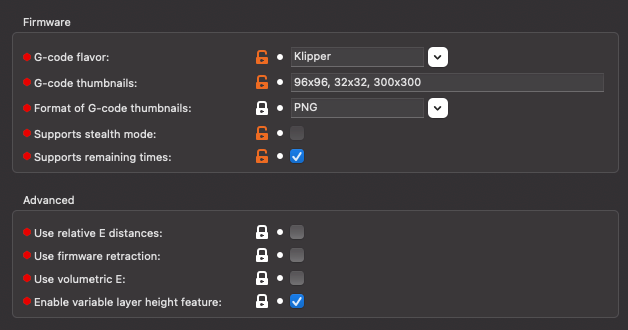
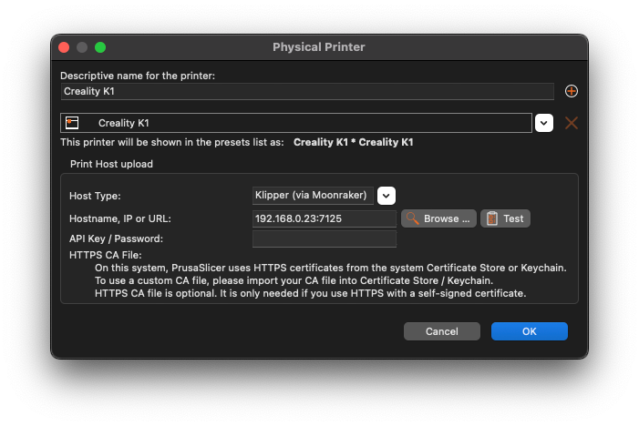

# Prusaslicer

Here I explain how to set up PrusaSlicer to be able to slice Gcodes for the Creality K1. Furthermore, you will find a
config bundle at the end, which you can import into PrusaSlicer.

# Printer settings

Important are the following Settings:

- G-code flavor: Klipper
- G-code thumbnails: 96x96, 32x32, 300x300
- Format of G-code thumbnails: PNG
- Use relative E distances: unchecked

<figure markdown>
  { width="800" }
  <figcaption>PrusaSlicer > Printer Settings > General</figcaption>
</figure>

## Custom G-codes

Start G-code:
```
M82 ;absolute extrusion mode
M140 S0
M104 S0 
SET_PRINT_STATS_INFO TOTAL_LAYER=[total_layer_count]
START_PRINT EXTRUDER_TEMP={first_layer_temperature[0]} BED_TEMP=[first_layer_bed_temperature]
```

End G-code:
```
END_PRINT
; total layers count = [total_layer_count]
```

Before layer change G-Code:
```
;BEFORE_LAYER_CHANGE
;[layer_z]
```

After layer change G-code:
```
;AFTER_LAYER_CHANGE
;[layer_z]
SET_PRINT_STATS_INFO CURRENT_LAYER={layer_num + 1}
```

## Physical Printer

Please use the Host Type `Klipper (via Moonraker)`, type in your IP address and add the port `7125` with a `:` for
Moonraker after the IP, like in the screenshot below:

<figure markdown>
  { width="800" }
  <figcaption>PrusaSlicer > Physical Printer</figcaption>
</figure>

## Profiles

Here you can find a full Printer Config Bundle for the Creality K1 with 0.2mm Layer-Height and nobufil ABSx Filament:

- [Download Config Bundle](../../slicer-profile/PrusaSlicer_config_bundle-Creality_K1.ini)