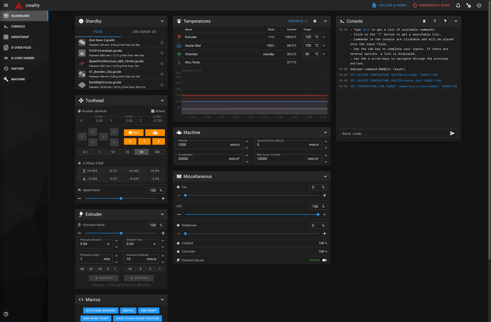

# Mainsail

We need to download the static files from Mainsail, enable NGINX service on the K1, and modify the path to the static
files. This is done in a few steps.

## Download static files

I have provided a customized Mainsail version for the K1. We download it from this repo and unzip it.

```bash
mkdir /usr/share/mainsail
cd /usr/share/mainsail
wget -q -O mainsail.zip https://github.com/meteyou/creality-k1/raw/main/mainsail/mainsail.zip && unzip mainsail.zip && rm mainsail.zip
```

## Enable NGINX and modify path

Change `nginx.conf`:
```bash
cd /etc/nginx
mv nginx.conf nginx.conf.bak
wget -q -O nginx.conf https://github.com/meteyou/creality-k1/raw/main/mainsail/nginx.conf
```

Activate and modify NGINX service file:
```bash
cd /etc/init.d
rm S50nginx
wget -q -O S50nginx https://github.com/meteyou/creality-k1/raw/main/mainsail/S50nginx
chmod 775 S50nginx
```

And now you can start NGINX with: `/etc/init.d/S50nginx restart`

After a successful restart, you can open your browser with the address `http://<ip>:81` and you should see Mainsail:

<figure markdown>
  { width="800" }
  <figcaption>Mainsail dashboard</figcaption>
</figure>
