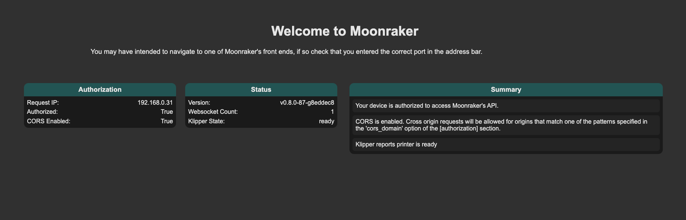

# Moonraker

Moonraker is already installed by default, but unfortunately an outdated version and not activated.

## Clone default Moonraker

First we download the default Moonraker files and install the dependencies.

```bash
cd /usr/share
git clone https://github.com/Arksine/moonraker.git moonraker-org
./moonraker-env/bin/pip install -r ./moonraker-org/scripts/moonraker-requirements.txt
```

## Download default settings

As a second step, we download the default settings:

```bash
cd /usr/data/printer_data/config/
wget https://raw.githubusercontent.com/meteyou/creality-k1/main/moonraker-config/moonraker.conf
```

## Activate service

The last step is to activate the service. Here we download a ready to use service file and replace the standard file:

```bash
cd /etc/init.d/
rm S56moonraker_service
wget https://raw.githubusercontent.com/meteyou/creality-k1/main/moonraker-config/S56moonraker_service
chmod 755 S56moonraker_service
```

After this change we can restart the printer and check if Moonraker is available. To restart the printer, execute the
following command:

```bash
reboot
```

If the printer has started successfully, open a browser window and open the address `http://<ip>:7125`. A page like this
should be displayed:

<figure markdown>
  { width="800" }
  <figcaption>Moonraker dashboard</figcaption>
</figure>
